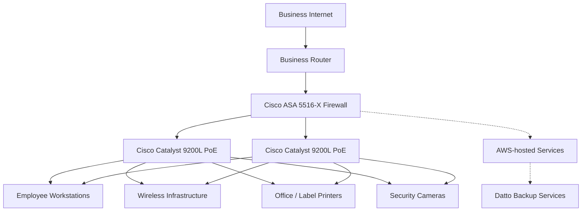

# Logical Network Diagram

This is a portfolio-friendly reconstruction of the project's logical-design concept. It is intentionally high-level and does not invent addressing, VLAN IDs, routing protocols, or security rules that are not documented in the source material.

## Interpretation

The source project selected and reused network infrastructure while proposing improvements primarily around Internet capacity, wireless performance, endpoint performance, rack cooling, and workplace ergonomics.

This diagram is a **documentation aid**, not the original academic diagram and not a production configuration.
