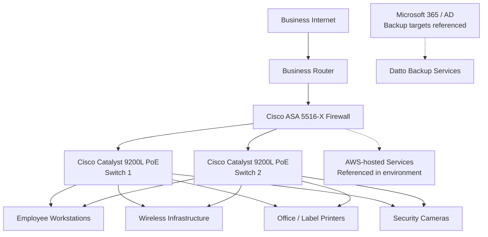

# Logical Network Diagram

This is a portfolio-friendly reconstruction of the project's logical-design concept. It is intentionally high-level and does not invent addressing, VLAN IDs, routing protocols, firewall policies, access-point models, or production configuration values that are not documented in the source material.

## Interpretation

The source project retained selected existing switching and firewall infrastructure while proposing improvements around Internet capacity, wireless performance, endpoint performance, rack capacity/cooling, and workplace ergonomics.

AWS-hosted services were referenced as part of the existing environment. The source also documented Datto backups for Microsoft 365 and Active Directory; the diagram therefore keeps those backup targets separate rather than implying that Datto is an AWS backup service.

The two 9200L switches shown here follow the explicit physical asset-list entry. The original source also contains a 9300 reference; that inconsistency is documented in [Source Validation Notes](../documentation/source-validation.md).

This diagram is a **documentation aid**, not the original academic diagram and not a production configuration.
