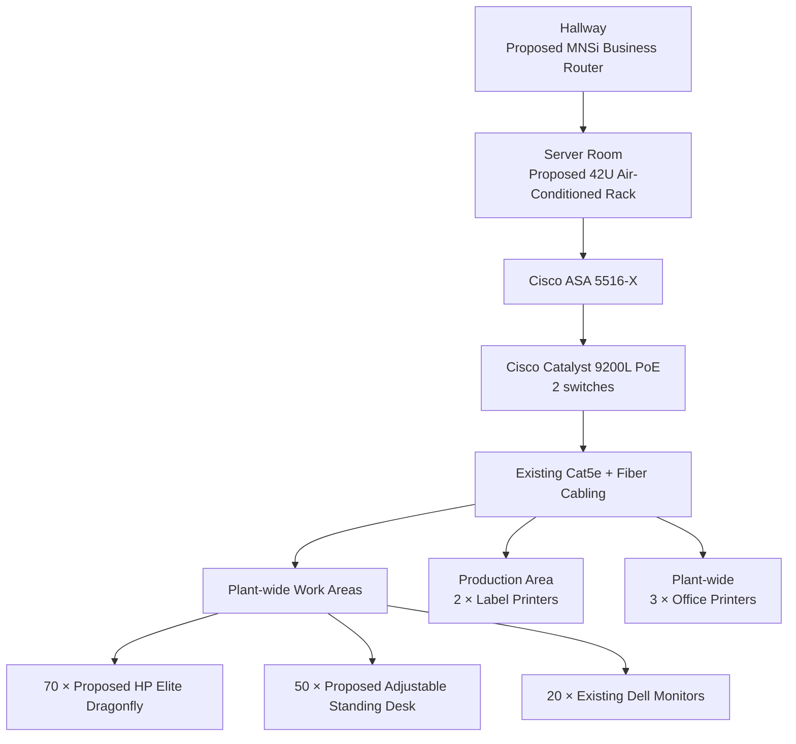

# Physical Network Design Diagram

This diagram summarizes the physical-design placement documented by the project. It is a simplified portfolio representation and does not replace the original floor-plan drawings.

## Planned Physical Changes

- Replace the existing leased Dell Inspiron 5000 fleet with the proposed HP Elite Dragonfly notebooks.
- Install a larger 42U air-conditioned rack in the server room.
- Retain the documented Cisco Catalyst 9200L switches and Cisco ASA 5516-X firewall.
- Retain selected monitors, peripherals, printers, Cat5e, and fiber cabling.
- Introduce adjustable-height staff desks across the planned work areas.

## Status

The physical design was completed as part of the project. The diagram represents the **proposed physical plan**; the student team did not carry out the production installation.
