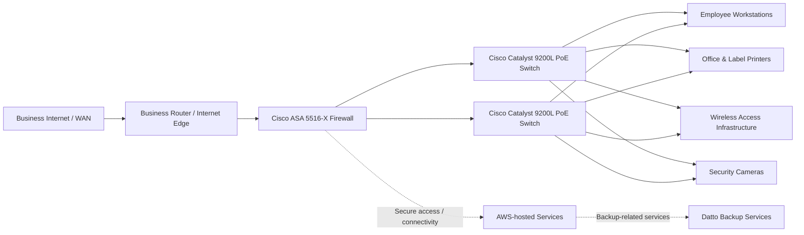

# Network Architecture

## Purpose

This document presents a portfolio-friendly, high-level view of the **proposed** network architecture described in the Network Design Specification project. It is a conceptual representation of the design work, not a production configuration or deployment record.

## Proposed Architecture

> **Diagram note:** The diagram is intentionally high-level. It represents the project components and design relationships without inventing VLAN IDs, IP addressing, routing protocols, firewall rules, switch configurations, or access-point models that are not documented in the source material.

## Design Intent

The proposed design addressed four primary areas:

1. Improve Internet and wireless performance.
2. Improve employee workstation performance.
3. Improve server-rack capacity and cooling.
4. Improve workplace ergonomics.

The project also retained selected existing infrastructure rather than replacing every component. The physical asset plan specifically identifies two Cisco Catalyst 9200L 48-port PoE switches, a Cisco ASA 5516-X firewall, a 715W UPS/power supply, existing monitors/peripherals, printers, Cat5e cabling, and fiber cabling for reuse.

## Connectivity and Services

The source project documented a 50/50 Mbps fiber Internet service and AWS-hosted services used for functions including email, Active Directory, and storage. Datto was documented as the backup service, with backups occurring three times per day for Microsoft 365 and Active Directory-related data.

The logical design evaluated higher-speed business Internet options, including MNSi for Business at 500/500 Mbps and Gigabit Business Fibe at 940/940 Mbps.

## Scope Boundary

The student team completed the requirements, analysis, logical-design, and physical-design work and produced an implementation plan. Physical installation, configuration, testing, and ongoing maintenance were not performed by the team. Therefore, this architecture should be read as a **proposed design**, not as evidence of a deployed production network.
